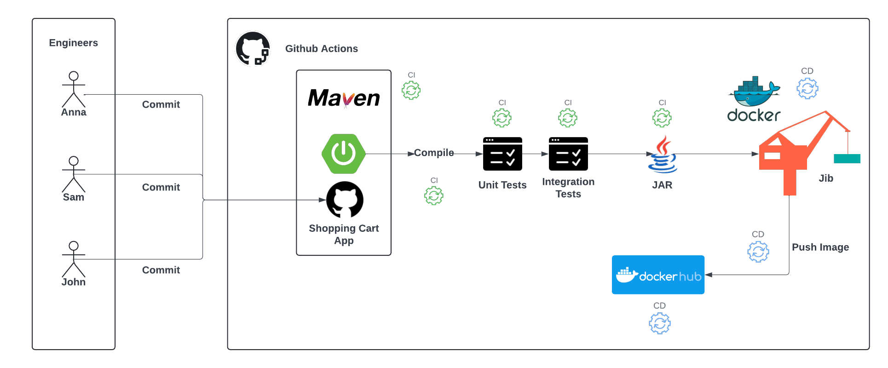

# Shopping Cart API

## Overview

The Shopping Cart API is a robust and scalable service designed to manage the shopping cart functionality for an e-commerce platform. It follows a well-structured n-tier architecture to ensure separation of concerns, scalability, and maintainability.

## How to Run

To run the Shopping Cart API locally, follow these steps:

1. **Download the `docker-compose.yml`** file from this repository.
2. **Run the following command** in your terminal to build and start the services:

    ```sh
    docker compose up --build
    ```

3. **Swagger Support**:
    - Swagger UI is available at [http://localhost:8080/swagger](http://localhost:8080/swagger) to test the APIs.
4. Use "john.doe@example.com" and "password123" to get the token from /auth/login endpoint.
5. Add the token in the top right section of Swagger UI to access all the endpoints.

This command will build the Docker images and start the containers as defined in the `docker-compose.yml` file.

## Architecture


### Workflow Overview

1. **Code Commit**: Developers commit code changes to the repository.
2. **Continuous Integration (CI) with GitHub Actions**:
   - **Compile**: Maven compiles the source code.
   - **Unit Tests**: Runs unit tests using JUnit.
   - **Integration Tests**: Runs integration tests.
   - **Package**: Packages the application into a JAR file using Maven.
3. **Containerization**:
   - **Build Docker Image**: The JAR file is containerized using Jib including all the dependencies, creating a Docker image without a Dockerfile. 
4. **Continuous Deployment (CD)**:
   - **Push to Docker Hub**: The Docker image is pushed to Docker Hub for storage and distribution.

## Database Design


The Shopping Cart API follows an n-tier architecture, which is a common design pattern used to separate different functionalities of an application into distinct layers. Here’s a brief overview of each layer:

## Implementation Details

The application is structured into several packages, each responsible for different aspects of the system:

- **Config**: Contains configuration classes for the application.
- **Controller**: Contains the REST controllers that handle HTTP requests.
- **DAO**: Contains Data Access Objects that interact with the database.
- **DTO**: Contains Data Transfer Objects used for transferring data between layers.
- **Exceptions**: Contains custom exception classes.
- **Model**: Contains the domain models representing business entities.
- **Repository**: Contains repository interfaces for database operations.
- **Service**: Contains service classes that implement the business logic.
- **Security**: Implements JWT security for the application, ensuring secure communication and authentication.

## CI/CD Pipeline


This project is completely backed by a GitHub Actions CI/CD pipeline:

- Continuous Integration (CI): The CI pipeline takes care of running unit and integration tests to ensure that the code is functional and meets the defined quality standards. It automatically runs on pull requests and pushes to the main branch.
- Continuous Deployment (CD): The CD pipeline handles deploying the Docker image to Docker Hub. This ensures that the latest version of the application is always available in the Docker Hub repository. The application can then be fetched from Docker Hub for deployment.

## Flyway Migrations


The Shopping Cart API uses Flyway for database migrations. Flyway ensures that the database schema is versioned and can be migrated to newer versions in a consistent and repeatable manner. Migrations are defined in the `resources/db.migration` directory.

## Getting Started

To get started with development, clone the repository and build the project using Maven:

```sh
git clone https://github.com/yourusername/shoppingcart.git
cd shoppingcart
./mvnw clean install
```

## Running Tests
```sh
./mvnw test
```

## Future Development
For future development, I am looking to create a Terraform-based AWS Elastic Beanstalk (EBS) setup to deploy this application further. This setup will help in automating the deployment process and managing the infrastructure as code, providing a more scalable and maintainable deployment solution.